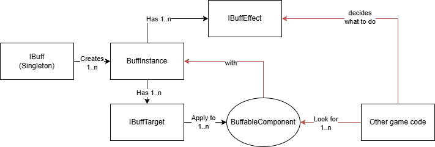

With this mod, you can effortlessly apply buffs or debuffs to any in-game entity, such as Beavers, Manufactories, Buildings, or other objects. The mod includes pre-built UI components, a manager, and common use case classes, allowing you to focus on creating the desired effects without worrying about debugging or implementation details.

- Demo project: [Source code](https://github.com/datvm/TimberbornMods/tree/master/BuffDebuffDemo), [Steam Workshop](https://steamcommunity.com/sharedfiles/filedetails/?id=3436101949)
- Global Wellbeing (using this mod): [Source code](https://github.com/datvm/TimberbornMods/tree/master/GlobalWellbeing), [Steam Workshop](https://steamcommunity.com/sharedfiles/filedetails/?id=3433812252)

# Guides

- [Quick Read](./quickstart)
- [Step-by-step Guide](./stepbystep)

# Architecture

The Buff & Debuff System consists of the following components:

- `IBuffEntity`: everything is a buff entity and they have a unique `long Id` assigned when registered to the `IBuffEntityService`.
    - `IBuffEntityService`: the singleton service that manages all buff entities. You can get all or one by Id with this service. `Register` and `Unregister` most likely won't need to be called by you.

- `BuffableComponent`: Attached to all entities in the game. They have a unique ID to identify them. You can get them all from the `IBuffableService` singleton.

More coming soon...
