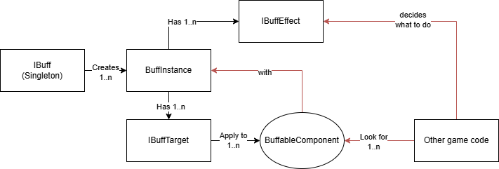

## The very short list

1. Refer to the mod DLL.
2. Create and register an `IBuff` singleton instance.
3. Create one (or more) `BuffInstance`.
4. Create `IBuffTarget` and `IBuffEffect` for the `BuffInstance`.
5. Process the applied `BuffInstance` in your mod using Singleton, BaseComponent or Harmony patch.

## A bit more detailed

1. Add the mod reference to your project. The file should be at `"SteamLibrary\steamapps\workshop\content\1062090\3433810580\version-0.7\BuffDebuff.dll"`.
    - Optionally add `global using BuffDebuff` as this will be the namespace for all Buff & Debuff System classes.

2. Create a singleton **Buff** class similar to `BuffDebuffDemo.Buffs.PositiveBuff` that implements `IBuff`. This class will declare general information about the buff, such as its name, description. It will also act as a manager and factory for the **BuffInstance**.
    - You can create a class from scratch or inherit from `SimpleBuff`, `SimpleValueBuff` or `SimpleFloatBuff`. The latter two are for buffs that create instances with a simple value.
    -  If you use `SimpleValueBuff` or similar, you do not have enough class (`BuffInstance`) to provide for the generic parameters yet. Just ignore and go ahead to the next step.
    - You are not limited to one type of `BuffInstance` for a `Buff`. You can create any number of `BuffInstance` of any type(s) you want.

> [!TIP]  
> `BuffInstance`, `IBuffTarget`, and `IBuffEffect` all have `Init()`, `Update...()` and `CleanUp()` methods. You can override them to add your custom logic.

3. Create a **BuffInstance** class similar to `BuffDebuffDemo.Buffs.PositiveBuffInstance` that inherit `BuffInstance`. This class will declare the targets and effects of the **Buff**.
    - You can inherit your class directly from `BuffInstance` or use some provided classes that support common use cases, such as `BuffInstance<TValue, TBuff>` or `TimedBuffInstance`.
    - **BuffInstance** must have a `new()` (parameterless) constructor. You then use `InjectAttribute` to inject necessary services into the instance similar to how you code a `BaseComponent`.
    - Use `Init()` to setup your instance. This method is called after the instance is created **and injected**. You would have your `IBuffInstance<TBuff>.Buff` and `IValuedBuffInstance<TValue>.Value` available at this point as well if your instance is of those types.
    - Use `Update()` if you need to update your instance every tick even when its `Active` is `false`. If you set `Active` to `false`, the `Targets` won't be called right in that tick.
4. Create `IBuffTarget`(s) for your buff instance to target. This interface will define the target(s) of the buff instance.
    - You can create a class from scratch or inherit from `GlobalBuffTarget` and its subclasses (`GlobalBeaverBuffTarget`, `GlobalAdultBeaverBuffTarget`, `GlobalChildBeaverBuffTarget`, `GlobalBotBuffTarget`), or `IdsBuffTarget`.
    - Each tick, `UpdateTargets()` is called. If the `TargetsChanged` property is `true`, the game will use `Targets` as new targets and remove the buff instance from the old targets.
5. Create `IBuffEffect`(s) for your buff instance to apply. There is `UpdateEffect()` method that is called every tick if you need to.

6. Create another class (it can be a game's singleton or a Harmony patch) that uses `IBuffService` to scan for your `BuffInstance`. Then decide what to do with the `IBuffEffect`(s) that they have.
    - Another way (recommended in the [Step-by-step guide](./stepbystep.MD)) is to add another `BaseComponent` to the entities that the buff can apply to (like `BeaverSpec`) and listen to the events.