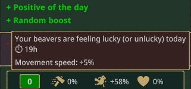
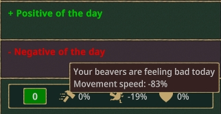
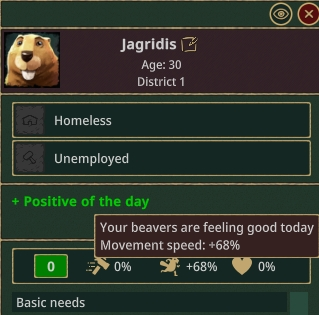

This is a step-by-step guide for creating [Buff Debuff Demo](https://github.com/datvm/TimberbornMods/tree/master/BuffDebuffDemo), a mod that uses the Buff & Debuff System to give beavers:
- A random Movement Speed buff and debuff every day. The amount is random but stay the same for the whole day.
- A random Movement Speed buff that last for a random amount of time (hours) every day.



## TOC

1. [Refer to the mod assembly (DLL)](#1-refer-to-the-mod-assembly-dll)
2. [Create Positive Buff](#2-create-positive-buff)
    1. [Create `PositiveBuff` class](#21-create-positivebuff-class)
    2. [Create `PositiveBuffInstance` class](#22-create-positivebuffinstance-class)
    3. [Create `SpeedBuffEffect` class](#23-create-speedbuffeffect-class)
    4. [Register the Buff](#24-register-the-buff)
    5. [Test the Buff](#25-test-the-buff)
3. [Create `BeaverBuffComponent`](#3-create-beaverbuffcomponent)
    1. [Create `BeaverBuffComponent` class](#31-create-beaverbuffcomponent-class)
    2. [Register the Component](#32-register-the-component)
    3. [Test the Buff](#33-test-the-buff)
- [Practice 1](#practice-1)
- [Practice 2](#practice-2)
4. [Create Lucky Buff (with Timed Buff Instance)](#create-lucky-buff-with-timed-buff-instance)

## 1. Refer to the mod assembly (DLL)

- Add the mod reference to your project. The file should be at _SteamLibrary\steamapps\workshop\content\1062090\3433810580\version-0.7\BuffDebuff.dll_.

- Add `BuffDebuff` as a required mod for your mod:

**manifest.json**
```jsonc
{
    // Other entries
    "RequiredMods": [
        {
            "Id": "BuffDebuff",
            "MinimumVersion": "7.0.0"
        }
    ]
}
```

- Optionally add `global using BuffDebuff` or `<Using Include="BuffDebuff" />` as this will be the namespace for all Buff & Debuff System classes.

**BuffDebuff.csproj**
```xml
<PropertyGroup>
    <BuffDebuffPath>$(ModPath)3433810580\version-0.7\BuffDebuff.dll</BuffDebuffPath>
</PropertyGroup>

<ItemGroup>
    <Using Include="BuffDebuff" />

    <Reference Include="$(BuffDebuffPath)">
        <Private>False</Private>
    </Reference>		
</ItemGroup>
```

> [!NOTE]  
> - `<Private>False</Private>` makes sure the DLL is not copied to the output directory. The game will load it from the Buff & Debuff mod folder and you should not need to copy it to your mod folder.
> - This project uses a few new language features (like Primary Constructor) that are available in C# 9.0. Add `<LangVersion>latest</LangVersion>` to your project file if you want to use them.

### Optional: make Localization entries

Add [`Localizations\enUS.csv`](https://github.com/datvm/TimberbornMods/blob/master/BuffDebuffDemo/Localizations/enUS.csv) file (if not exist) to your mod to support localization. You need a few entries like the name and description for the buff. For example:

```csv
ID,Text,Comment
LV.BuffDebuffDemo.PositiveBuff,"Positive of the day",The name of the positive buff
LV.BuffDebuffDemo.PositiveBuffDesc,"Your beavers are feeling good today",The description of the positive buff
<More content...>
```

## 2. Create Positive Buff

First we create a positive buff that gives beavers a random movement speed buff (0% - 100%) every day.

Each buff consists of a `Buff` class and one or more `BuffInstance` classes. The `Buff` class is a singleton that manages the buff instances. It also provides general information about the buff, such as its name and description.

The `BuffInstance` class defines the targets and effects of the buff. It is the actual instance that is attached to the entities in the game.

### 2.1 Create `PositiveBuff` class

[See full content with helpful comments here: **PositiveBuff.cs**](https://github.com/datvm/TimberbornMods/blob/master/BuffDebuffDemo/Buffs/PositiveBuff.cs)

```cs
// This is a singleton IBuff instance. It is not applied to the entities (Buffable) directly but it provides some information about the buff.
// Think of it as a Manager for the buff. It is created once and then it creates the instances of the buff.
public class PositiveBuff(ISingletonLoader loader, IBuffService buffs, ILoc t, EventBus eb) : SimpleFloatBuff<PositiveBuff, PositiveBuffInstance>(loader, buffs), IUnloadableSingleton
{
    // ...
}
```

- Since every buff instance needs the speed boost value, we use `SimpleFloatBuff` as the base class instead of implementing `IBuff` from scratch. Later we will see another example to use only `SimpleBuff`.

- `PositiveBuffInstance` is not available yet, but we will create it in the next step. If you are annoyed by the error like me, you can create an empty class for now.

```cs
// The unique key to save and load the buff, in this case we only need to save the Id,
// The logic is already implemented in the base class
static readonly SingletonKey SaveKey = new("PositiveBuff");
protected override SingletonKey SingletonKey => SaveKey;
```

- The `SaveKey` is used to save and load the buff instances. The logic is already implemented in the base class if you do not need to store any extra info.

```cs
// The name and description of the buff
public override string Name { get; protected set; } = t.T("LV.BuffDebuffDemo.PositiveBuff");
public override string Description { get; protected set; } = t.T("LV.BuffDebuffDemo.PositiveBuffDesc");
```

- The `Name` and `Description` properties will be used in the UI to display the buff information. Here we use `ILoc.T()` to get the localized text.

```cs
    // Register and unregister this service for the event we need (DaytimeStartEvent)
    protected override void AfterLoad()
    {
        base.AfterLoad();
        eb.Register(this);
    }

    public void Unload()
    {
        eb.Unregister(this);
    }

    // We update the buff instances when the day start
    [OnEvent]
    public void OnDaytimeStart(DaytimeStartEvent _)
    {
        // ...
    }
```

- This logic depends on your mod. In this case, we update the buff instances when the (game) day starts so we use `DaytimeStartEvent`.
    - To know exactly what you need, use ILSpy to check the game source code or ask for help in the Discord server.

```cs
// Remove the previous buff
// There should be only one but we remove all just in case
// This logic can actually be processed with the BuffInstance as well if you want to
// but in this case we keep it here so we don't have to store the day of the buff instance.
var existing = buffs.GetInstances<PositiveBuffInstance>();
foreach (var i in existing)
{
    buffs.Remove(i);
}
```

- In this mod I demonstrate how you can remove a buff through `IBuffService`.

```cs
const float MaxBuffPerc = 1f; // 100%;

// Add the new buff
var perc = UnityEngine.Random.Range(0, MaxBuffPerc); // Get the random speed boost percentage
var instance = CreateInstance(perc); // CreateInstance is implemented in the base class
buffs.Apply(instance);
```

- The above code generates a random speed boost percentage and creates a new buff instance with that value, then applies it to the entities.

> [!NOTE]  
> At the end of the sample file, I also added a commented out section on one of the way to process the buff using `BuffAddedToEntityEvent` and `BuffRemovedFromEntityEvent` though it's not recommended. You can check it out if you are curious.

### 2.2 Create `PositiveBuffInstance` class

[See full content with helpful comments here: **PositiveBuffInstance.cs**](https://github.com/datvm/TimberbornMods/blob/master/BuffDebuffDemo/Buffs/PositiveBuffInstance.cs)

```cs
public class PositiveBuffInstance : SimpleFloatBuffInstance<PositiveBuff>
{
    // ...
}
```

- Here we simply use `SimpleFloatBuffInstance<PositiveBuff>` as the base class to create a buff instance with a float value that would be set by the `PositiveBuff` on creation.

```cs
// Indicate this is a positive buff and will show up in the positive buff panel
public override bool IsBuff { get; protected set; } = true;
```

- This is for UI only. The positive (buff) and negative (debuff) buffs will be displayed in different panels, one in green and one in red:  


> ![TIP]  
> This means you can create a single `IBuff` that generate both Buff & Debuff. For example, instead of creating two separate buffs a day that cancel one another, I can create a single buff and set `IBuff` like this:  
> `public override bool IsBuff { get; protected set; } = Value >= 0;`

```cs
// These need to be set later
public override IEnumerable<IBuffTarget> Targets { get; protected set; } = [];
public override IEnumerable<IBuffEffect> Effects { get; protected set; } = [];
```

- `Targets` determine which entities the buff will be applied to. You can write your own class or use the provided ones like `GlobalBeaverBuffTarget` or `IdsBuffTarget`.

- `Effects` determine what the buff will do to the entities. It likely will just be a value to be read by others.

- For now we leave them empty because we cannot create them yet.

> ![Caution]  
> `BuffInstance` has to have a `new()` (parameterless) constructor. You then use `InjectAttribute` to inject necessary services into the instance similar to how you code a `BaseComponent`. That's why at the time of inititalization, we don't have the injected services, `Value` or `Buff` available yet.

```cs
// We cannot inject them with constructor because this class must have a parameterless constructor
// So we inject them with InjectAttribute instead
IBuffableService buffables = null!;
EventBus eb = null!;
ILoc t = null!;

// Add anything you need to inject here
[Inject]
public void Inject(IBuffableService buffables, EventBus eb, ILoc t)
{
    this.buffables = buffables;
    this.eb = eb;
    this.t = t;
}
```

- We use `[Inject]` attribute to inject the necessary services into the instance. The services will be injected after the instance is created.
    - This is handled by `IBuffService.CreateBuffInstance()` method.

```cs
// Here for this instance we know there is only one Effect of one kind so we give it directly
// so we can easily access it later without iterating through the Effects
// Note that we cannot init it here because Value is still not set when the class is created yet.
public SpeedBuffEffect Effect { get; private set; } = null!;

// This method is called after the BuffInstance was created and injected. Buff property and Value properties are set.
// Init is also called when the game is loaded and the values are loaded from the save.
public override void Init()
{
    // We set the targets: GlobalBeaverBuffTarget and similar are already implemented by the system
    Targets = [new GlobalBeaverBuffTarget(buffables, eb)];
    
    // Then we add the speed effect:
    Effect = new SpeedBuffEffect(t, Value);
    Effects = [Effect];
}
```

- `SpeedBuffEffect` is created later.

- Instead of using constructor or field initialization, `Init()` is called after the instance is created and injected. This is where you set up the instance.
    - It is guaranteed to be called before any `Update()` happens, including after the game is loaded and the values are loaded from the save if relevant.

- In this `BuffInstance` since we only have one Effect of a known type, we add the `Effect` property so we can easily access it later without iterating through the Effects.

```cs
// In case you need to modify the save and load logic, you can override these methods
// The base class already saves and loads the Value property for you so in this case we do not need to modify it

// If you do not want to save an instance (for example, you can always create it by the IBuff on load), return null
// If you return null, the instance will not go into the game file
protected override string? Save()
{
    return base.Save();
}

// If you update your mod and no longer want to load a save, or the save data is not desired any more, return false
// If you return false, the instance created will then be discarded.
protected override bool Load(string savedState)
{
    return base.Load(savedState);
}
```

- Depends on your logic, you can override `Save()` and `Load()` methods to modify the save and load logic. The base class already saves and loads the `Value` property for you so in this case we do not need to modify it.

- You can also cancel the saving or loading of an instance by returning `null` or `false` respectively.
    - When your `Load` method returns `false`, the instance created will then be discarded and `Apply` is not called so you do not need to worry about it. Note that `CleanUp()` is not called in this case.

> ![TIP]  
> - The reason for having `Save` returning `null` is that some instance does not need to be saved. For example, in my **Global Wellbeing** mod, after a game is loaded, the `Buff` can just create the `BuffInstance` again based on the current Wellbeing state.
> - The reason for having `Load` returning `false` is that you may update your mod and the previous data may not be relevant anymore or if the data becomes corrupted.

- You can optionally override the `AdditionalDescription` property to show more information in the tooltip.

### 2.3 Create `SpeedBuffEffect` class

[See full content with helpful comments here: **SpeedBuffEffect.cs**](https://github.com/datvm/TimberbornMods/blob/master/BuffDebuffDemo/Buffs/SpeedBuffEffect.cs)

```cs
// This is an effect a buff should have.
// Use it however you want. In this project, we can reuse this one for all 3 buffs.
// In your game, you may have different effects to show up in the tooltip.
public class SpeedBuffEffect(ILoc t, float speed) : IBuffEffect
{
    // ...
}
```

- An `IBuffEffect` usually is just a simple class that holds data to be read by others. You can use it however you want though since it also has all three methods `Init()`, `Update()` and `CleanUp()`.

- Personally, I keep it simple and in this project, since it just holds data, I reuse it for all 3 buffs.

```cs
// Show as percentage
const string Format = "+#%;-#%;0%";

// This will show up in the tooltip, something like:  Movement speed: +50%
public string? Description { get; } = t.T("LV.BuffDebuffDemo.SpeedBuffEffectDesc", speed.ToString(Format));
```

- The `Description` property will be shown in the tooltip. Here we use `ILoc.T()` to get the localized text.

```cs
// For the other code to access and process the speed bonus
public float Speed => speed;
```

- Info you need for your logic can be added as properties.

```cs
public long Id { get; set; }

public void CleanUp() { }
public void Init() { }
public void UpdateEffect() { }
```

- Just members that are required by the interface. (I really should make a base class for this!)

### 2.4 Register the Buff

In your mod configuration ([ModConfigs.cs](https://github.com/datvm/TimberbornMods/blob/master/BuffDebuffDemo/ModConfigs.cs) in this project), register the buff:

```cs
// Register these under the Game context
[Context("Game")]
public class GameConfig : Configurator
{
    public override void Configure()
    {
        // Buffs should be singleton
        Bind<PositiveBuff>().AsSingleton();

        // ...
    }
}
```

- That's all you need, only the `IBuff` instance needs to be registered as a singleton.

### 2.5 Test the Buff

Now you can test the buff in the game. Load the game with this mod and _wait for the day to start_ to see the buff applied to the beavers.

> ![TIP]  
> Use Dev Mode (Alt + Shift + Z) to speed up the game time. You can press "Skip to next day time" some times to get to the next day (7 is the hotkey)



You can also try saving the game, then reloading it to make sure the value is saved and loaded correctly. And try skipping to the next day to see the buff value changed.

However you can see two problems:

1. The buff is not applied until the next day. We will fix this later.
2. The buff is there but no actual effect is there because there is no logic to apply the speed boost.

## 3. Create `BeaverBuffComponent`

To apply the speed boost to the beavers, we attach a `BaseComponent` to all Beavers. This component will listen to the `BuffAddedToEntityEvent` and `BuffRemovedFromEntityEvent` events and apply the speed boost when the positive buff is added.

### 3.1 Create `BeaverBuffComponent` class

[See full content with helpful comments here: **BeaverBuffComponent.cs**](https://github.com/datvm/TimberbornMods/blob/master/BuffDebuffDemo/BeaverBuffComponent.cs)

```cs
// This is a BaseComponent that will attach to the Beaver entities only (due to our declaration in the Config)
// This is the recommended way to process the buff instances compared to the commented out code in PositiveBuff
// because only entities that can receive the buff will have this component
public class BeaverBuffComponent : BaseComponent
{
    // ...
}
```

- Later we will attach this component to each Beaver using `TemplateModule`.

```cs
// We need the BonusManager to apply the bonus to the entity
BonusManager bonusManager = null!;
// We need the BuffableComponent to unregister the event
BuffableComponent buffable = null!;

// When the object is initialized, we grab the BuffableComponent and register the event
public void Awake()
{
    // We know each Beaver has a BonusManager attached (from the game code)
    bonusManager = GetComponentFast<BonusManager>();

    buffable = GetComponentFast<BuffableComponent>();
    // Register the event
    buffable.OnBuffAdded += Buffable_OnBuffAdded;
    buffable.OnBuffRemoved += Buffable_OnBuffRemoved;
    buffable.OnBuffActiveChanged += Buffable_OnBuffActiveChanged;
}

public void OnDestroy()
{
    // Unregister the event
    buffable.OnBuffAdded -= Buffable_OnBuffAdded;
    buffable.OnBuffRemoved -= Buffable_OnBuffRemoved;
    buffable.OnBuffActiveChanged -= Buffable_OnBuffActiveChanged;
}
```

- In `Awake()`, we grab the `BonusManager` and `BuffableComponent` we knew each Beaver has, then register the events.

- In `OnDestroy()`, we unregister the events to clean up.

> ![NOTE]  
> According to the usual game code, maybe the event registration should be registered in `Start()` instead of `Awake()`. It's up to you to decide.

```cs
// Here we can narrow down to our own Instance, or we can just process indiscriminately for all buffs
// as long as they have the SpeedBuffEffect
private void Buffable_OnBuffAdded(object sender, BuffInstance e)
{
    // We can process all the speed effect here
    if (!e.Active) { return; }

    var speedEffect = e.Effects.Where(q => q is SpeedBuffEffect).Cast<SpeedBuffEffect>();
    foreach (var effect in speedEffect)
    {
        bonusManager.AddBonus(Constants.MovementSpeedBonusId, effect.Speed);
    }
}
```

- Just in case, we check for `Active` property. Though in this project, we do not set `Active` to `false`, maybe another mod does.

- You can optionally check if `e` is your own `PositiveBuffInstance` or not but we should just process based on the `IEffect`s instead. This way you can reuse the `SpeedBuffEffect` for other buffs, even when they are not yours.

```cs
private void Buffable_OnBuffRemoved(object sender, BuffInstance e)
{
    // Process similarly but to remove the bonus
    if (!e.Active) { return; }

    var speedEffect = e.Effects.Where(q => q is SpeedBuffEffect).Cast<SpeedBuffEffect>();
    foreach (var effect in speedEffect)
    {
        bonusManager.RemoveBonus(Constants.MovementSpeedBonusId, effect.Speed);
    }
}
```

- Similar to `Buffable_OnBuffAdded`, we remove the bonus when the buff is removed.

```cs
// We know that for our case this one does not happen (we do not Activate/Deactivate our buff instances)
// But if you do, you can process it here
private void Buffable_OnBuffActiveChanged(object sender, BuffInstance e)
{
    if (e.Active)
    {
        Buffable_OnBuffAdded(sender, e);
    }
    else
    {
        Buffable_OnBuffRemoved(sender, e);
    }
}
```

- Another event to handle is when the `Active` property of the buff instance changes. In this project we do not do it but you may change it in the future or another mod does.

### 3.2 Register the Component

In your mod configuration ([ModConfigs.cs](https://github.com/datvm/TimberbornMods/blob/master/BuffDebuffDemo/ModConfigs.cs)), register the component:

```cs
public override void Configure()
{
    // ...

    // Decorator Component for the Beavers as the recommended way to process the Buffs
    MultiBind<TemplateModule>().ToProvider(() =>
    {
        TemplateModule.Builder b = new();
        b.AddDecorator<BeaverSpec, BeaverBuffComponent>();
        return b.Build();
    }).AsSingleton();
}
```

- The above code will attach the `BeaverBuffComponent` to any entity with a `BeaverSpec` component (i.e. Beavers).

### 3.3 Test the Buff

Now load the game again, you should see the speed boost applied to the beavers immediately when the buff is added (see that stat below the buff panel).

Try going to the next day to see the buff value changed and the correct speed boost applied to the beavers.

## Practice 1

**Fix the Buff not applied until the next day**

When the user first loads the game with your mod newly installed, or when they start a new game, the buff is not applied until the next day. You can try thinking of a way to fix it.

You can see the solution in the `PositiveBuff.cs` file. I folded the code in `#region` so you can hide it if you want to try it yourself.

> [!CAUTION]  
> You should not just apply an extra buff if you see no BuffInstance is applied on `Load` or even `PostLoad`. `BuffInstance`s are loaded on `PostLoad` and they relies on `IBuff` so they are not there yet.

<details>
<summary>Tip 1</summary>
You can add a property to determine if an initial buff is applied or not.
</details>

<details>
<summary>Tip 2</summary>
To save additional properties, you should override <code>LoadSingleton</code> and <code>SaveSingleton</code> instead of <code>Load</code> and <code>Save</code> to retain the logic of the base class.

> ![IMPORTANT]  
> You should call `base.LoadSingleton` and `base.SaveSingleton` in your override.
</details>

## Practice 2

**Create a Negative Buff**

Create a negative buff that gives beavers a random movement speed debuff (0% - 100%) every day. The code is very similar to the positive buff, you can reuse a lot of the code.


You can see the solution in the [`NegativeBuff.cs`](https://github.com/datvm/TimberbornMods/blob/master/BuffDebuffDemo/Buffs/NegativeBuff.cs) and [`NegativeBuffInstance.cs`](https://github.com/datvm/TimberbornMods/blob/master/BuffDebuffDemo/Buffs/NegativeBuffInstance.cs) files.

<details>
<summary>Tip 1</summary>
You can just reuse <code>SpeedBuffEffect</code> for this buff as well, just with a negative value. This way you don't even need to create any new processing logic.
</details>

<details>
<summary>Tip 2</summary>
If you don't see the buff, make sure you have the <code>NegativeBuff</code> registered in the mod configuration.
</details>

## 4. Create Lucky Buff (with Timed Buff Instance)

Each day, the beavers also get a random movement speed buff that lasts for a random amount of time between 0 to 30 hours. This is a bit more complex because we need a timed buff instance, and this time there is a chance two or more buff instances are present at the same time.

### 4.1 Create `LuckyBuff` class

[See full content with helpful comments here: **LuckyBuff.cs**](https://github.com/datvm/TimberbornMods/blob/master/BuffDebuffDemo/Buffs/LuckyBuff.cs)

```cs
// This buff will create LuckyBuffInstance, a timed buff.
// Since LuckyBuffInstance is not a BuffInstance<TValue, TBuff>, we cannot use SimpleValueBuff but only SimpleBuff
// We then make our own `CreateInstance` that was provided by SimpleValueBuff.
public class LuckyBuff(ISingletonLoader loader, IBuffService buffs, ILoc t, EventBus eb) : SimpleBuff(loader, buffs), IUnloadableSingleton
{
    // ...
}
```

- Since `LuckyBuffInstance` is not a `BuffInstance<TValue, TBuff>`, we cannot use `SimpleValueBuff` but only `SimpleBuff`.
    - What we will be missing is only a `CreateInstance` method that we can easily implement.

```cs
LuckyBuffInstance CreateInstance(float hours, float perc)
{
    // Do not just create an instance directly, you need to inject the services
    // And values if it's of IValuedBuffInstance
    return buffs.CreateBuffInstance<LuckyBuff, LuckyBuffInstance, LuckyBuffInstanceValue>(this, new(hours, perc));
}
```

- Note: `LuckyBuffInstance` is not available yet, but we will create it in the next step.

- To create an instance of `LuckyBuffInstance`, we need to use `IBuffService.CreateBuffInstance()` method. This method will inject the necessary services _and value_ into the instance.

```cs
[OnEvent]
public void OnDaytimeStart(DaytimeStartEvent _)
{
    const float MaxBuffPerc = .2f; // Only 20% compared to other buffs' 100%
    const float MaxBuffHours = 30f; // There is a chance two or more buffs exist at once

    // We do not remove existing instance like the other buffs

    // Now we create a random boost for a random amount of hours
    var hours = UnityEngine.Random.Range(0, MaxBuffHours);
    var perc = UnityEngine.Random.Range(0, MaxBuffPerc);

    // Lucky buff is applied with positive percentage
    var instance = CreateInstance(hours, perc);
    buffs.Apply(instance);

    Debug.Log($"Lucky buff applied with {perc:P} speed increased for {hours:F1} hours");
}
```

- The logic is similar to the `PositiveBuff` but we do not remove the existing instance. This is because we do not remove the buff when the day starts, but when the buff duration ends.

_Other parts of the code are similar to `PositiveBuff` so I will not repeat them here._

### 4.2 Create `LuckyBuffInstance` class

[See full content with helpful comments here: **LuckyBuffInstance.cs**](https://github.com/datvm/TimberbornMods/blob/master/BuffDebuffDemo/Buffs/LuckyBuffInstance.cs)

```cs
// Since this BuffInstance needs a few values, we create a record to hold them.
public readonly record struct LuckyBuffInstanceValue(float Hours, float Speed);
```

- This time instead of using a `float` as the sole value, we use a `struct` (or anything you like) to hold both the hours and the speed boost value.

```cs
// This BuffInstance is timed so we use TimedBuffInstance which already has the logic for processing it
// We also implement IValuedBuffInstance<LuckyBuffInstanceValue> because TimedBuffInstance doesn't support it out of the box.
public class LuckyBuffInstance : TimedBuffInstance<LuckyBuff>, IValuedBuffInstance<LuckyBuffInstanceValue>
{
    // Property for IValuedBuffInstance<LuckyBuffInstanceValue> so the IBuffService can set it automatically
    public LuckyBuffInstanceValue Value { get; set; }

    // ...
}
```

- We use `TimedBuffInstance` as the base class because this buff is timed. The base class already has the logic for: saving and loading the remaining time, removing the buff when the time is up.

- We implement `IValuedBuffInstance<LuckyBuffInstanceValue>` because we can then use `IBuffService.CreateBuffInstance()` to inject the `Value` property into the instance.

```cs
// This is the total time when the buff starts. Make sure it's available before Init() call of the base class.
public override float StartingTime => Value.Hours;

// If you override AdditionalDescription, note that the base class already has a logic to show the time left.
// public override string? AdditionalDescription { get => base.AdditionalDescription; protected set => base.AdditionalDescription = value; }
```

- `AdditionalDescription` is already implemented in the base class to show the remaining time. You can override it to show more information.

- `StartingTime` is the total time when the buff starts. Make sure it's available before `Init()` call of the base class.

> ![TIP]  
> Unless you have special logic, saving `StartingTime` is not necessary because the base class already saves and loads the remaining time for you.

```cs
// These are the dependencies that the TimedBuffInstance needs to process it,
// so we need to inject them as well beside what extra you may need
protected override IBuffService Buffs { get; set; } = null!;
protected override IDayNightCycle DayNight { get; set; } = null!;
protected override ILoc T { get; set; } = null!;

IBuffableService buffables = null!;
EventBus eb = null!;

[Inject]
public void InjectDeps(IBuffService buffs, IDayNightCycle dayNight, ILoc t, IBuffableService buffables, EventBus eb)
{
    // Beside injecting your own dependencies, you need to inject the base class dependencies as well
    base.Inject(buffs, dayNight, t);

    this.buffables = buffables;
    this.eb = eb;
}
```

- Beside the dependencies you need, you also need to inject the base class dependencies. You can do this by calling `base.Inject()`. Those are the services the base class needs to process the timed buff.

_Other parts of the code are similar to `PositiveBuffInstance` so I will not repeat them here._

### 4.3 Register the Buff

In your mod configuration, register the buff like the other buffs:

```cs
public override void Configure()
{
    // ...

    Bind<LuckyBuff>().AsSingleton();
}
```

### 4.4 Test the Buff

Now load the game again, you should see the lucky buff applied to the beavers every day. The buff will last for a random amount of time between 0 to 30 hours.


This buff's bonus should stack with the positive buff and the negative buff you created.

You can also try saving the game, then reloading it to make sure the value and remaining time is saved and loaded correctly.