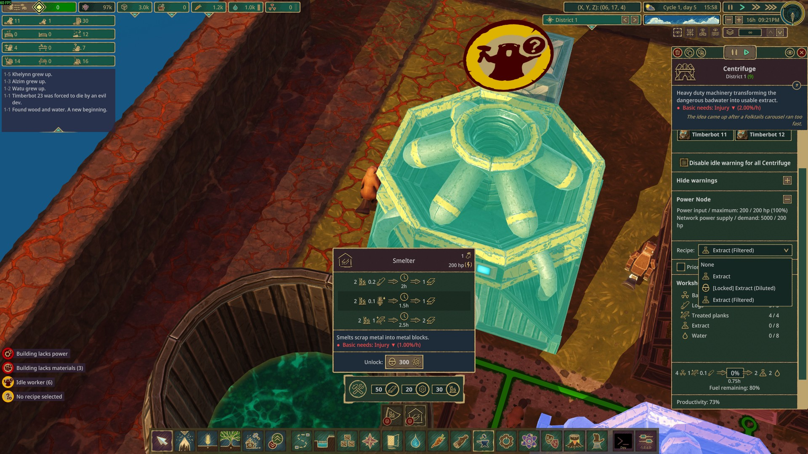

# Moddable Recipes

This mod lets you lock or unlock recipes at runtime. You can also modify a recipe live at runtime. You can also check out [the Demo project here](../../ModdableRecipesDemo/) or [Scientific Projects: Alternate Recipes](../../ScientificProjects/AlternativeRecipesSPs/).

**Features:**
- Lock or unlock recipes at any time.
- Modify recipe, including ingredients or products or any of the `RecipeSpec` properties at any time.
- With this mod active, you can also have multiple recipes in the same building with the same _good_ in both ingredients and products.
- With v10.0, the UI is no longer clunky like v7.



# The `ModdableRecipeLockSpec`

In order to lock any recipe, the `RecipeSpec` must have a `ModdableRecipeLockSpec` attached. You can append it to an existing recipe like the demo [`Recipe.Plank.blueprint.json`](../../ModdableRecipesDemo/Root/Recipes/Recipe.Plank.blueprint.json):

```json
{
    "ModdableRecipeLockSpec": {
        "DescriptionLoc": "LV.MRecDemo.LockDesc"
    }
}
```

A more complete example is the [``DoublePlank.blueprint.json`](../../ModdableRecipesDemo/Root/Recipes/DoublePlank.blueprint.json):

```jsonc
{
    "RecipeSpec": {
        "Id": "DoublePlank",
        // ...
    },
    "ModdableRecipeLockSpec": {
        "DescriptionLoc": "LV.MRecDemo.LockDesc",
        "UnlockByDefault": true,
        "LockTitle": "Censored"
    }
}
```

All properties are _optional_:
- `DescriptionLoc`: show when the player pick the locked recipe (if visible). Use a default localization key if not specified. Default `null`.

- `UnlockByDefault`: if `true`, the recipe is not locked. Default `false` (automatically locked any recipe with `ModdableRecipeLockSpec`).
- `LockTitle`: how should the title of the locked recipe appear:

  - `Hidden` (default): the recipe is completely hidden from the player when locked.
  - `Censored`: the recipe appears with a censored title (`[Locked] [Secret Recipe]`). You can use the `DescriptionLoc` to give hints about how to unlock it.
  - `Visible`: the recipe appears with its normal title prepended with `[Locked]`.
- `VisibleFactions`: if specified any, `LockTitle` only applies to those factions. It's hidden from all other factions. Default `[]`.

# The `ModdableRecipeLockService`

To lock or unlock a recipe, inject the `ModdableRecipeLockService` service like the [`TestModdableRecipeFragment.cs`](../../ModdableRecipesDemo/UI/TestModdableRecipeFragment.cs):

```cs
public class TestModdableRecipeFragment(ModdableRecipeLockService locker) // ...
{
    void ToggleLock(string id)
    {
        var isLocked = locker.IsLocked(id, out _);

        if (isLocked)
        {
            locker.Unlock(id);
        }
        else
        {
            locker.Lock(id, t.T("LV.MRecDemo.LockDesc"));
        }
    }
}
```

When `Lock` and `Unlock` are called, the recipe UI will automatically update to reflect the change. All Manufactory buildings with a locked recipe would select back to None.

> [!WARNING]  
> - Try not to lock a previously not-locked recipe. If a player has already selected that recipe in a previous save, they get to keep it on load.  
> - **DO NOT** lock all recipes in a building. All behaviors are undefined if that happens.

Other useful methods include:
- `public bool IsLocked(string id, [NotNullWhen(true)] out string? reason)`
- `public ModdableRecipeLockStatus GetLockStatus(string id)` (returns the status along with the `LockTitle` if locked).

> [!TIP]  
> You can also use `ModdableRecipePersistentUnlocker` service to permanently unlock recipes (kind of fire and forget). You can still lock it later if you want.

# The `LiveRecipeModifierService`

The `LiveRecipeModifierService` lets you modify any recipe at runtime. You can pretty much change anything in the `RecipeSpec`. Same example from the [`TestModdableRecipeFragment.cs`](../../ModdableRecipesDemo/UI/TestModdableRecipeFragment.cs):

```cs
async void ChangeCustomOutput()
{
    var curr = specs.GetRecipe(CustomPlankId);

    var id = await diag.PromptAsync("Enter output good:", curr.Products[0].Id);
    if (string.IsNullOrEmpty(id)) { return; }

    var amountStr = await diag.PromptAsync("Enter output amount:", curr.Products[0].Amount.ToString());
    if (string.IsNullOrEmpty(amountStr) || !int.TryParse(amountStr, out var o) || o <= 0) { return; }

    liveRecipeModifier.Modify(CustomPlankId, r => r with
    {
        Products = [new() {
            Id = id,
            Amount = o,
        }],
    });
}
```

The service will modify the **original** spec itself so any changes would be reflected everywhere.

> [!WARNING]  
> When modifying a recipe, all Manufactory buildings using that recipe will automatically reapply the recipe, causing them to drop their current progress.

It's fine if you modify it at a singleton's `ILoadableSingleton.Load` because it's before any building is loaded. The player does not lose progress when loading their save.