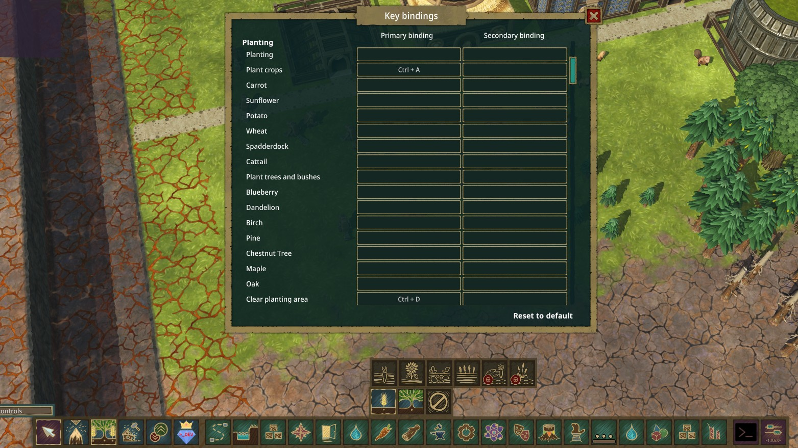

Players can subscribe to an optional mod "Moddable Tool Groups Hotkeys" to have keybindings for custom tools (which also includes built-in tools overwritten by Moddable Tool Groups).



For full examples, see the mod's [`BuilderPrioritiesButtonCustomRootElement`](../../ConfigurableToolGroups/UI/BuiltInRootProviders/BuilderPrioritiesButtonCustomRootElement.cs) or [`PlantingBuiltInButtonCustomRootElement`](../../ConfigurableToolGroups/UI/BuiltInRootProviders/PlantingButtonCustomRootElements.cs) or the Demo project's [`PlantingGroupElement`](../../ModdableToolGroupsDemo/UI/PlantingGroupElement.cs) for multi-level hotkeys.

**Block Object Tools are automatically supported**.

## The `IHotkeySupportedTool` interface

To add hotkey support, simply implement the `IHotkeySupportedTool` interface in your custom tool class:

```cs
public class PlantingGroupElement : IHotkeySupportedTool
{
    public IEnumerable<IToolHotkeyDefinition> GetHotkeys() => hotkeys;
}
```

Each returned `IToolHotkeyDefinition` will generate a `KeyBindingSpec`:

- `Id`: the unique ID for the hotkey. Don't make it collide with existing `KeyBindingSpec` though `IToolHotkeyDefinition.Id` collision will be handled by the mod.
- `LocKey`: the localized name of the hotkey.
- `GroupId`: default to the `Tools` `KeyBindingGroup` if not specified.
- `Order` (`int?`): the order of the hotkey in the group. If not specified, it will be ordered by names then assigned automatically.
- `IsDevTool`: whether it's a dev tool hotkey (only works if the Dev Mode is enabled).
- `Select()`: the action to perform when the hotkey is pressed.

## The `IToolHotkeyDefinition` default implmentations

You can return your own `IToolHotkeyDefinition` or use one of the provided default implementations:

- `ToolHotkeyDefinitionBase`: Simplify the properties. `Select()` method is still abstract.
  - `ButtonToolHotkeyDefinition`: for tool buttons (`IToolbarButton`) which is most of the cases.
  - `ActionHotkeyDefinition`: a simple Action delegate.