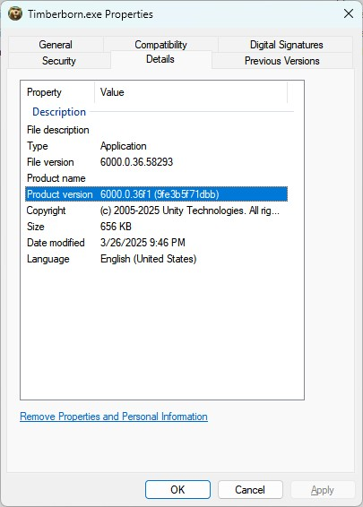
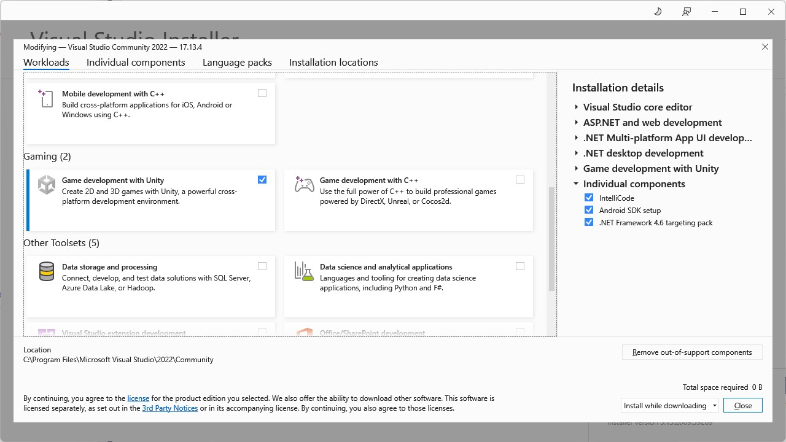
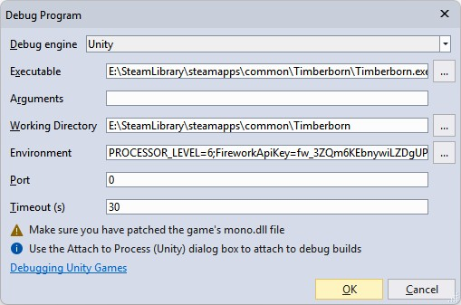
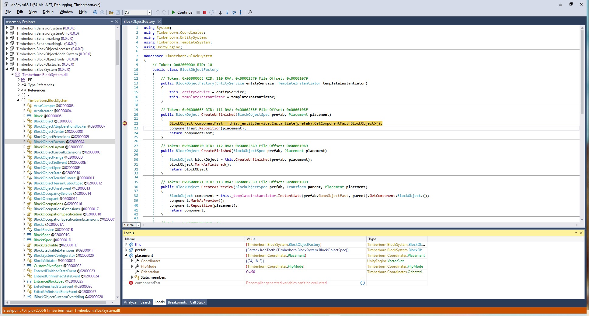
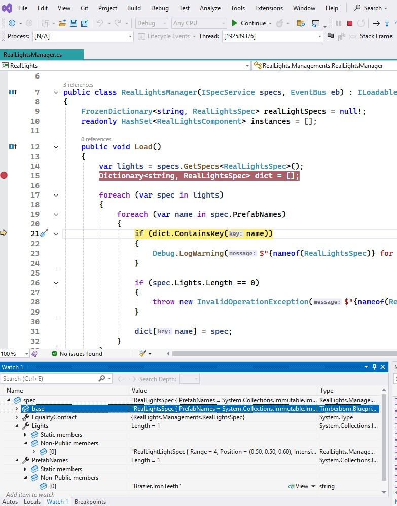

[Home](../) / [Modding Guide](./) / Attach a Debugger to Timberborn

**This guide can be done totally thanks to `normanr`. All credits go to him. I just made a few changes to make it easier to follow. Parts of this guide is from [dnSpy's guide](https://github.com/dnSpy/dnSpy/wiki/Debugging-Unity-Games#turning-a-release-build-into-a-debug-build) and [Let's Play with Fire Wiki](https://wiki.fireundubh.com/unity/turning-a-release-build-into-a-debug-build).**

This short guide will show you how to attach a debugger to Timberborn and debug the game code or your mods using DnSpy and Visual Studio.

- With dnSpy, you can debug the game code using the game's assemblies (DLLs) or ripped assemblies from AssetRipper.
- With Visual Studio, you can debug your mod code.

# Installation guide

1. Determine and install the Unity version the game is using:
    - Right click on the Timberborn executable and select `Properties`. Go to the `Details` tab and look for `Product version`. For example at the time of writing, the version is `6000.0.36f1`.

    - Go to [Unity Download Archive]( https://unity.com/releases/editor/archive) and download the corresponding version (you don't actually need to run it, just need some files from it).

> **Tip:** while waiting for the download and installation, you should make a backup of your game's folder.  
I myself even create  Git repository for the game folder, then create a branch called `dev-build` so I can easily switch between the dev build and the normal game because the Dev build does have a lot of dev UI that are not useful when you are not debugging the game.

2. Go to this folder you just installed, `Unity 6000.0.36f1\Editor\Data\PlaybackEngines\windowsstandalonesupport\Variations\win64_player_development_mono`:
    - Copy the content of the `Data` folder over to your game's `Timberborn_Data` folder, overwriting everything.
    - Copy `WindowsPlayer.exe` + `UnityPlayer.dll` to your game's folder (where `Timberborn.exe` is). Rename or delete the original `Timberborn.exe` then rename `WindowsPlayer.exe` to `Timberborn.exe`.

3. Edit `Timberborn_Data\boot.config` and add these two lines:

```ini
wait-for-managed-debugger=1
player-connection-debug=1
```

4. (Optional) If you want to use Visual Studio, make sure you have "Game development with Unity" installed. You can check this in Visual Studio Installer.



That's it. If you use my tip above, now you can make a commit into the new branch `dev-build` and you can switch between the dev build and the normal game easily.

# Debugging with DnSpy

You can either use `Start` command or `Attach to Unity` command in DnSpy. Then you simply load the game's DLLs (either directly from the game folder or from AssetRipper) and you can put breakpoints and debug the game code.



For example, I put a breakpoint at `Timberborn.BlockSystem.BlockObjectFactory.CreateUnfinished` for when I want to know what happens when I build a building:



# Debugging with Visual Studio

> **Note:** in order to debug your mod's code, make sure you built your mod with embedded Debug symbols. You need this in your `csproj` file:

```xml
<PropertyGroup>
    <!-- Others code -->
    <DebugSymbols>true</DebugSymbols>
    <DebugType>embedded</DebugType>
</PropertyGroup>
```

Then when the game run, you can click `Debug > Attach Unity Debugger` in Visual Studio and select the `Timberborn.exe` process. You can put breakpoints in your mod's code and debug it like a normal C# project.



---

[Back to Modding Guide](./)