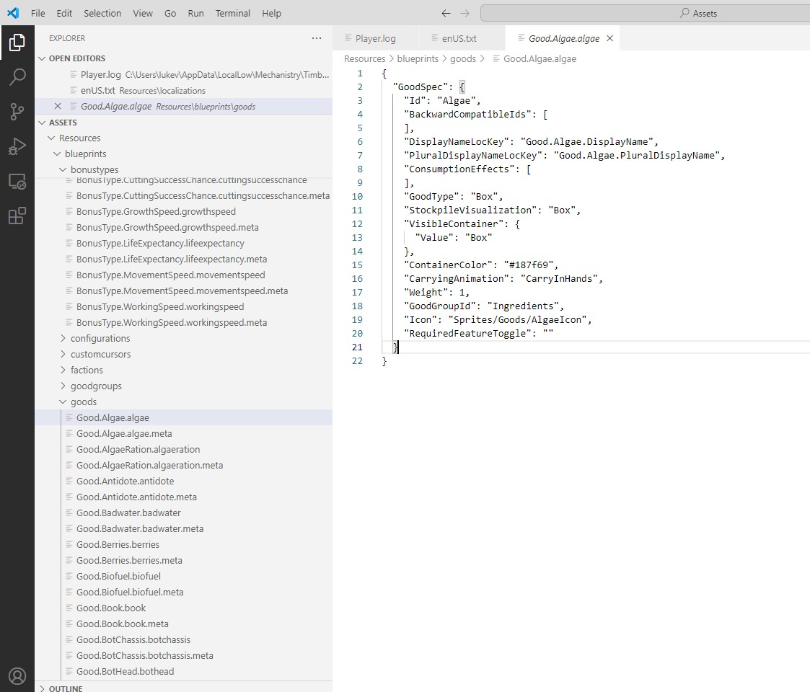
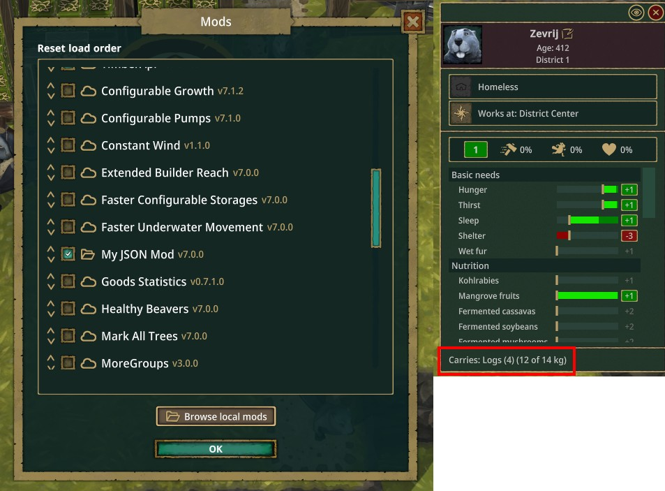

[Home](../) / [Modding Guide](./) / Getting Started

In this part of the series, we will set up your modding environment and make a simple code-less mod. This will help you to understand the basic structure of a mod and how to make it work in Timberborn.

## A simple IDE

You can use any IDE you like (even Notepad) but I recommend using Visual Studio Code because it is lightweight.

Download: https://code.visualstudio.com/

## AssetRipper

AssetRipper is a tool that can extract game assets from Unity games. It is useful for modding because it allows you to extract textures, models, and other assets from the game to use them in your mods.

- Download: https://github.com/AssetRipper/AssetRipper/releases

Run the tool and select the game's executable file (e.g. `Timberborn.exe`). Then, you can extract all assets from the game to a folder. It will take a while to extract all assets so be patient. Most of the time the interesting assets are in the `Assets\Resources` folder.

I usually use VS Code to browse the extracted assets.



## Making a simple code-less mod

This is actually all you need to make a mod for Timberborn though you can't do much beside modifying existing assets. But it is a good way to start and understand the basic structure of a mod.

### Step 1: Create `manifest.json` file

_Reference: [Official Timberborn Modding](https://github.com/mechanistry/timberborn-modding)_

1. Go to `Documents\Timberborn\Mods` folder and create a new folder `MyJsonMod` (the folder name does not matter).
2. Open the folder with VS Code and create a `manifest.json` file:

```json
{
    "Name": "My JSON Mod",
    "Version": "7.0.0",
    "Id": "MyFirstMod",
    "MinimumGameVersion": "0.7.0.0",
    "Description": "The very first mod.",
    "RequiredMods": [
        {
            "Id": "AnotherMod",
            "MinimumVersion": "0.1"
        }
    ],
    "OptionalMods": [
        {
            "Id": "YetAnotherMod"
        }
    ]
}
```

The above snippet is a basic manifest file for a mod. It's pretty self-explanatory and we can remove the `RequiredMods` and `OptionalMods` sections if we don't need them.

> **Note:**  
> The game uses `0.7.0.0` for update 7 and `0.6.0.0` for update 6.

### Step 2: Make a modification

> **Warning:**  
> For Update 6, the game (and official modding guide) uses `Specifications` folder but for Update 7, it is renamed to `Blueprints`. I will use `Blueprints` in this guide.

Now you can look at the Assets you have extracted and find something you want to modify. For example, I will modify the `Good.Log.log` blueprint (the Log resource) and reduce its weight from 6 to 3.

Make `Good.Log.json` file (note the file extension is `.json`), preferrably in the same path the game has, so: `Blueprints\Goods\Good.Log.json`:

```json
{
    "GoodSpec": {
        "Weight": 3
    }
}
```

Now run the game, you should see your mod in the mod list and the Log resource should have a weight of 3 instead of 6.



> **Tips:**  
> You can use Dev Mode (<kbd>Alt + Shift Z</kbd>) to quickly test your mod.

You can also put all above files into `version-0.7` folder so it will only loads for Update 7. For example it would be: `Documents\Timberborn\Mods\MyJsonMod\version-0.7\manifest.json`. This is how modders make mods compatible with multiple game versions.

## Conclusion

Unfortunately, you cannot do much with JSON mods beside some simple modifications.

In the next part, we will learn how to make mods with code.

[Part 2: Modding Basics](./modding-basics)

[Back to Modding Guide](./)