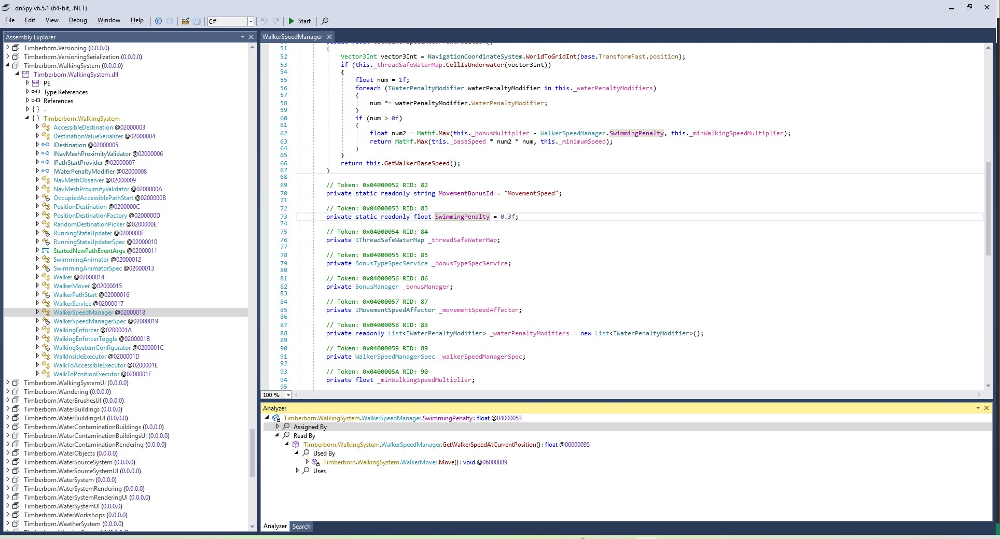

[Home](../) / [Modding Guide](./) / Getting Started

In this part, we will make a copy of [Faster Underwater Movement](https://steamcommunity.com/sharedfiles/filedetails/?id=3421130054) mod. The source code at the end of this and the next part is [here](https://github.com/datvm/TimberbornMods/tree/master/FasterUnderwaterMovement). In this part, we do not use Mod Settings yet.

## Tools

Besides the assets from [previous part](./getting-started.MD#assetripper), you will need some more tools for coding mods.

### .NET

_Personal choice: .NET 9 or the latest_

The game uses .NET so you need to have the .NET SDK installed on your computer. The game uses `netstandard2.1` but you can install the latest version of the .NET SDK to use the latest language features as long as they are syntactical sugar and not new features.

### IDE

_Personal choice: Visual Studio_

I personally use Visual Studio for modding Timberborn but you can also use Visual Studio Code or any other IDE you like.

- Download: https://visualstudio.microsoft.com/downloads/ (the Community version is free)

### Decompiler

_Personal choice: ILSpy_

I use ILSpy to decompile the game's assemblies. It is useful for understanding how the game works and finding the classes and methods you need to modify. You can also use DnSpy or any other decompiler you like.

- Download: https://github.com/icsharpcode/ILSpy or https://github.com/dnSpyEx/dnSpy

Once you have the app, go to your game's folder `steamapps\common\Timberborn\Timberborn_Data\Managed` and drag all `Timberborn.*.dll` files into the app.



The two features I use the most are Search and Analyze to find out where a method is called and what it does.

## Create a .NET project

_Reference: [Common.target](https://github.com/datvm/TimberbornMods/blob/master/Common.target)_

Create a .NET Class Library project. These are the popular items I use in my project's `.csproj` file:

```xml
    <PropertyGroup>
        <TargetFramework>netstandard2.1</TargetFramework>
        <LangVersion>preview</LangVersion>
        <ImplicitUsings>enable</ImplicitUsings>
        <Nullable>enable</Nullable>

        <DebugSymbols>true</DebugSymbols>
        <DebugType>embedded</DebugType>

        <AssemblyPath>E:\SteamLibrary\steamapps\common\Timberborn\Timberborn_Data\Managed</AssemblyPath>
    </PropertyGroup>

	<ItemGroup>
		<!-- Publicizer -->
		<PackageReference Include="BepInEx.AssemblyPublicizer.MSBuild" Version="0.4.3">
			<PrivateAssets>all</PrivateAssets>
			<IncludeAssets>runtime; build; native; contentfiles; analyzers; buildtransitive</IncludeAssets>
		</PackageReference>

		<!-- Game Assemblies -->
		<Reference Include="$(AssemblyPath)\Unity*.dll" Publicize="true">
			<DestinationSubDirectory>libs/</DestinationSubDirectory>
			<Private>False</Private>
		</Reference>
		<Reference Include="$(AssemblyPath)\Timberborn.*.dll" Publicize="true">
			<DestinationSubDirectory>libs/</DestinationSubDirectory>
			<Private>False</Private>
		</Reference>
		<Reference Include="$(AssemblyPath)\Bindito.*.dll" Publicize="true">
			<DestinationSubDirectory>libs/</DestinationSubDirectory>
			<Private>False</Private>
		</Reference>
		<Reference Include="$(AssemblyPath)\System.Collections.Immutable.dll">
			<Private>False</Private>
		</Reference>
		<Reference Include="$(AssemblyPath)\Newtonsoft.Json.dll">
			<Private>False</Private>
		</Reference>
	</ItemGroup>

	<ItemGroup>
		<None Update="manifest.json">
			<CopyToOutputDirectory>PreserveNewest</CopyToOutputDirectory>
		</None>
		<None Update="Localizations\**">
			<CopyToOutputDirectory>PreserveNewest</CopyToOutputDirectory>
		</None>
	</ItemGroup>
```

- We compile the project with `netstandard2.1` and use the latest language features.
- We also enable nullable reference types and implicit usings to make the code cleaner. These are personal choices.
- `DebugSymbols` and `DebugType` are set to `true` and `embedded` respectively to embed the debug symbols into the assembly. This helps that when your code crashes the game, we can see the line number in the stack trace.

> **Tip:**  
> Later in [Advanced modding](./advanced-modding), I will show you how to make these into a shared file so you can reuse them in all your projects like what I did in my mods.

### The Publicizer

The `BepInEx.AssemblyPublicizer.MSBuild` package is used to publicize the game's assemblies. This is very helpful to expose all the classes and methods in the game's assemblies so you can use them in your code.

Put your game path into the `AssemblyPath` property. This is the path to the `Managed` folder in your game's directory.

`<Private>false</Private>` is used to tell the compiler to not embed the game's assemblies into your mod's assembly.

### Manifest and Localizations files

Like [previous part](./getting-started.MD#step-1-create-manifestjson-file), your mod needs a `manifest.json` file. We use the `CopyToOutputDirectory` property to copy it to the output directory.

You can also add a `Localizations` folder to keep all your texts there and other modders can easily translate your mod as well. If you do, create `enUS.csv` file in there with content like this:

```csv
ID,Text,Comment
LV.FUM.SwimmingBonus,"Swimming speed bonus",
LV.FUM.SwimmingBonusDesc,"The bonus speed for beavers moving in water. 0.5 means 50% faster than walking on land.",
```

## Faster Underwater Movement

Create a class called `MSettings`. We do not use ModSettings for now but we will make a simple **singleton** class for now.

> **Note:**  
> In my older code, I call them `ModSettings` but it causes name collision so IntelliSense won't work well. I use `MSettings` now.

```csharp
public class ModSettings : ILoadableSingleton
{
    static readonly FieldInfo SwimmingPenalty = typeof(WalkerSpeedManager).GetField("SwimmingPenalty", BindingFlags.NonPublic | BindingFlags.Static);

    public void Load()
    {
        Debug.Log("Previous swimming penalty: " + SwimmingPenalty.GetValue(null));
        SetValue(0.5f);        
    }

    void SetValue(float bonus)
    {
        SwimmingPenalty.SetValue(null, -bonus);
    }
}
```

Using ILSpy or DnSpy, we can find the `SwimmingPenalty` field in `WalkerSpeedManager` class. We use reflection to set the value of this field to `-0.5f` to make beavers swim 50% faster.

> **Warning:**  
> I use Reflection here because the variable is a `readonly` one. However, recently I discovered it's a bad idea to set a `readonly` field using reflection because of some optimization. Luckily, for this mod, it's only set once before the value is grabbed so it still work.

### Register the singleton

The above code is not run by anything yet. We need to register it with the game's DI system. See [Timberborn Architecture](./timberborn-architecture) for more information.

Create a `ModConfigs.cs` file:

_Reference: [ModConfigurator.cs](https://github.com/datvm/TimberbornMods/blob/master/FasterUnderwaterMovement/ModConfigurator.cs)_

```csharp
[Context("MainMenu")]
[Context("Game")]
public class ModConfigurator : IConfigurator
{
    public void Configure(IContainerDefinition containerDefinition)
    {
        containerDefinition.Bind<ModSettings>().AsSingleton();
    }
}
```

When the game reaches the `MainMenu` or `Game` context, it will create an instance of `ModSettings` and call its `Load` method.

## Testing the mod

Build the project and copy the output files (you will have a `manifest.json` file and a `<project name>.dll` file at least) to your `Documents\Timberborn\Mods\<AnyModName>` folder.

> **Tip:**  
> In [Advanced modding](./advanced-modding), I will show you how to automate this process so you can just press a button to build and copy the files to the game's folder.

Run the game and you should see that beavers swim faster than before. You can also open the `Player.log` file (or the in-game console with <kbd>Alt + `</kbd>) to see the log message printed.

Personally, I find keeping VS Code open at the `Assets` folder, plus opening the `Player.log` file in that same workspace is very helpful.

## Conclusion

In this part, we have made a simple mod that makes beavers swim faster. We have also learned how to use reflection to modify the game's code. In the next part, we will learn how to use Harmony to patch the game's code and use Mod Settings to let players configure our mods.

[Part 3: Modding with Harmony and Mod Settings](./mod-settings-and-harmony)

[Back to Modding Guide](./)