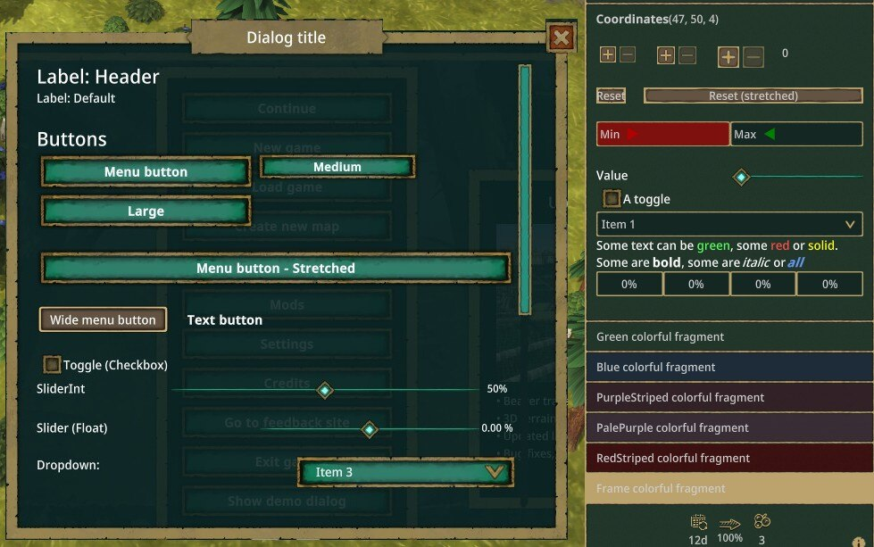

All source code are available at https://github.com/datvm/TimberbornMods (on the `master` branch).

# Table of Contents

- [Modding Guide](#modding-guide): [Guide](./ModdingGuide)
- [TimberUI](#timberui): [Docs](./TimberUI)
- [Buff & Debuff System](#buff--debuff-system): [Docs](./BuffDebuff) \| [Steam Workshop](https://steamcommunity.com/sharedfiles/filedetails/?id=3433810580) \| [Mod.io](https://mod.io/g/timberborn/m/buff-debuff-system)

# Modding Guide

A comprehensive guide to modding Timberborn is available at [Timberborn Modding Guide](./ModdingGuide).

# TimberUI

TimberUI is a mod for Timberborn that helps you build UI for your mods.

# Buff & Debuff System

With this mod, you can effortlessly apply buffs or debuffs to any in-game entity, such as Beavers, Manufactories, Buildings, or other objects. The mod includes pre-built UI components, a manager, and common use case classes, allowing you to focus on creating the desired effects without worrying about debugging or implementation details.

